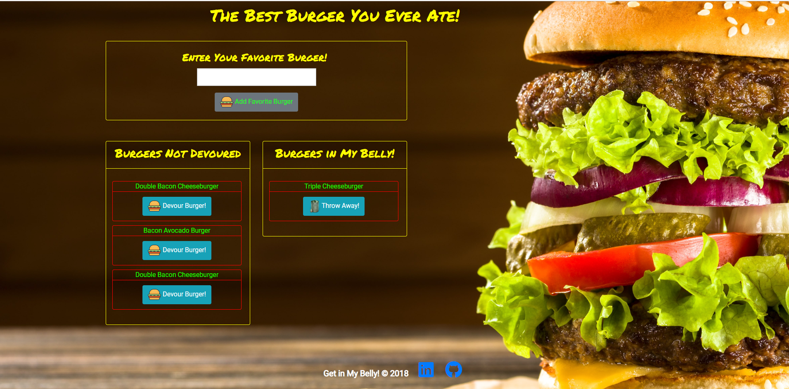

# **Burger in My Belly!**

Have you ever wondered what the best burger is?  With the Burger in My Belly app, you can find different types of burgers to try as well as list your own favorite burgers! 

## **Overview**
Burger in My Belly app allows a user to enter their favorite burger.  When the burger is added, it will be added to the Burgers Not Devoured list.  From there, the user can choose to "devour" the burger.  Once the burger is "devoured", the burger will move to the Burgers In My Belly list.  From here, the user can choose to throw away the burger, which will delete the burger from the page as well as the database. 

## **Link To App**
[Burger in My Belly](https://quiet-river-85172.herokuapp.com/)

## **Technical Information**
This app was created by using the following:

* JavaScript
* HTML
* CSS
* Handlebars 
* jQuery
* MVC

## **Author**
Brandy Nicholson
